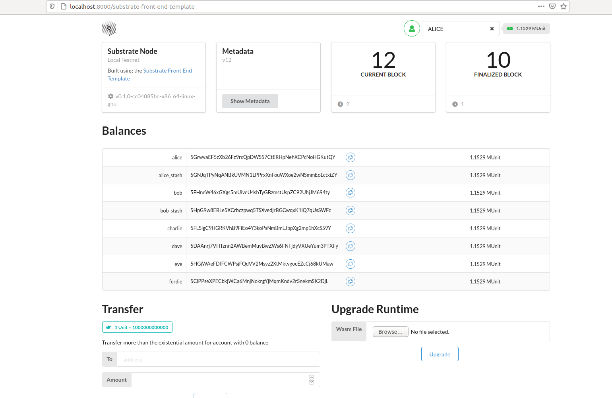
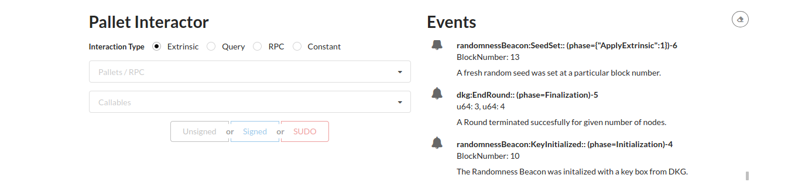
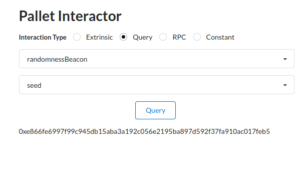

# Documentation of the Threshold BLS Randomness Beacon for Substrate

The Threshold BLS Randomness Beacon for Substrate consists of the following components:
 - **The Randomness Beacon Pallet**: `frame/randomness-beacon/`
 - **The DKG Pallet**: `frame/dkg/`
 - **RandomnessGossip** - a component responsible for offchain gossip of randomness shares of committee members: `client/randomness-beacon/lib.rs`
 - **Components responsible for coordinating block authorship and import** with the Randomness Beacon:
-- Wrapper on **block import** `client/randomness-beacon/import.rs`
-- Wrapper on **block authorship** `client/randomness-beacon/authorship.rs`
- **Cryptographic primitives**: `/primitives/randomness-beacon/src/` and `/primitives/dkg/src/`

We refer to the slides [link](https://docs.google.com/presentation/d/1DGCx_bqurKBfJUW28vkxBNHo_1mRvSfsqLqcEt-rgbU/edit?usp=sharing) that provide a high-level understanding of Threshold BLS Randomness Beacons in general, as well as explain this specific implementation (and in particular mention the above components) in Substrate.

For more detailed descriptions of these components we refer to the documentation within the source code. For the Randomness Beacon Pallet and DKG Pallet there are also separate documentation files in `/frame/randomness-beacon/README.md` and `/frame/dkg/README.md` respectively.

# Running an Integration Test
These are instructions on how to run an integration test on localhost of the BLS Randomness Beacon on 4 nodes with a threshold of 2.

## Using Docker
The working directory is the root of the project.

 1. `docker build -t rb .`

2.  `docker run --rm rb`

3.  open another console window and run `docker run --rm --env name=XXX rb`, where XXX=bob,charlie,dave
4. Inspect the logs in files `alice.log`, `bob.log`, `charlie.log`, `dave.log`

## Without the Docker (in Bash)
This assumes you have downloaded the newest version of the repository [https://github.com/Cardinal-Cryptography/substrate/tree/randomness-beacon-m3](https://github.com/Cardinal-Cryptography/substrate/tree/randomness-beacon-m3) and you have the most recent version of Rust. The working directory is the root of the project.

1.  run the command `./x.sh 4` -- it starts by compiling Substrate using `cargo +nightly-2020-08-23 build` so make sure your cargo is up-to-date

2.  Inspect the logs in files `alice.log`, `bob.log`, `charlie.log`, `dave.log`

3.  `killall -9 rb-node` to kill the nodes


# Running Unit Tests

To run all the unit tests for the Threshold BLS Randomness Beacon execute:
`cargo test -p sp-randomness-beacon -p sp-dkg -p sc-randomness-beacon -p pallet-randomness-beacon -p pallet-dkg --tests`


# Running Benchmarks

To compile the project for the purpose of running benchmarks navigate to the appropriate directory:
`cd bin/rb-node/node/`

and subsequently compile the project by running:
`cargo build --release --features runtime-benchmarks -p rb-node`

Note that the compilation will fail if you try to run the above from the root directory.

Now to run the benchmarks for the randomness-beacon pallet, run:
```
./target/release/rb-node benchmark \
    --chain=local \
    --execution=wasm \
    --wasm-execution=compiled \
    --pallet=pallet_randomness_beacon \
    --extrinsic "*" \
    --repeat 20 \```
```
Similarly for the dkg pallet, replace `--pallet=pallet_randomness_beacon` by `--pallet=pallet_dkg`. For the latter, you might want to reduce the `repeat` parameter to a smaller value, as otherwise the benchmark might take a lot of time (in the order of 1-2 hours).

## Results of Benchmarks
By analyzing the results of benchmarks one can conclude that (as expected) the heaviest part of the computation within the DKG pallet are the cryptographic primitives invoked from the  `bls12_381` library. In particular, since the Randomness-Beacon Pallet performs only a constant number of pairing operations per block it's performance is blazing fast even for `n` (the size of committee) of the order of hundreds. On the other hand in DKG, the number of cryptographic operations depends on `n` and hence the performance deteriorates when `n` grows.

More specifically, consider the results of benchmarking a representative "heavy" piece of code, i.e., the `post_disputes` extrinsic.
```
n mean µs sigma µs %
1 219300 1544 0.7%
7 452300 574.7 0.1%
13 670700 2201 0.3%
19 931400 4952 0.5%
25 1151500 28580 2.4%
31 1383200 45920 3.3%
37 1598100 20690 1.2%
43 1883500 56720 3.0%
49 2045900 11390 0.5%
55 2290100 7131 0.3%
61 2508700 24440 0.9%

Model:
Time ~= 188700
+ n 38290
µs
```

Already for `n=61` the cost is `2.5` sec which is quite heavy. By optimizing the code of the pallet and the cryptographic primitives within substrate one can likely bring this time down by a constact of 2 or 3. However, the source of the problem here is the BLS itself, and specifically  how it performs in WASM. Since this is pretty much a Proof of Concept implementation we did not try other BLS libraries. This is partly because the "no-std"  requirement for all Substrate code within the runtime is quite brutal and not many libraries satisfy it.

On the other hand, it is worth mentioning that the same code run with `--execution=Native` instead of `--execution=wasm` is actually 8-10 times faster, which is a **much higher speedup** than what some other benchmarks within substrate demonstrate. This is an indication that the problem lies in the BLS library, since this is the only piece of code that is "unusual" in this project. For comparison, the same benchmark run with `Native`:

```
    n   mean µs  sigma µs       %
    1     24930     281.4    1.1%
    7     58400     774.1    1.3%
   13     85590     636.1    0.7%
   19    113800      1859    1.6%
   25    137900      3775    2.7%
   31    176100      7237    4.1%
   37    202400      8957    4.4%
   43    230900      2558    1.1%
   49    247000     664.2    0.2%
   55    272000      1535    0.5%
   61    316000     16160    5.1%

Model:
Time ~=    24290
    + n     4686
              µs
```

# Inspecting the Randomness Beacon using the Front-End Template

The Threshold BLS Randomness Beacon is compatible with the Substrate Front-End Template. Below we give instructions on how to run it and inspect the state of the DKG Pallet and Randomness Beacon Pallet.

1. The first step is to install the Substrate Front-End Template, for this refer to the instructions [here](https://substrate.dev/docs/en/tutorials/create-your-first-substrate-chain/setup#install-the-front-end-template).
2. Run the 4-node integration test by executing `./x.sh 4` in the root directory of substrate (see also the instructions for running the Integration test above)
3. Run `yarn start` in the root directory of the Front-End Template

The above should open a browser window/tab with address `localhost:8000/substrate-front-end-template`  where you can inspect the chain state



By scrolling down you should be able to see the Event log. Both the DKG pallet and Randomness Beacon pallet emit events informing on their status that can be inspected in this log.



In the above one can see for instance the Randomness Beacon was initialized with a key from DKG, all 4 nodes have succesfully finalized the last (3rd) round of DKG and that the Seed for Block number 13 was correctly set.

Note that in the default configuration in the provided integration test, a fresh Seed is included in every second block, starting from block 13. The initial 12 blocks are used to run the DKG protocol and generate the Threshold BLS keys.

One can see how the seed changes by making an appropriate query in the `Pallet Interactor`.
1. Select `Query` as the `Interaction Type`
2. Select `randomnessBeacon`
3. Select `seed`
4. Click `Query`

This should show the current seed and should also update every couple of seconds, as below



# Adding the Randomness Beacon to a Custom Chain

Including the Threshold BLS Randomness Beacon to a Custom Substrate chain is rather simple.

 - First of all both pallets DKG and Randomness-Beacon should be added to to the runtime in a standard way. It is best to inspect `/bin/rb-node/runtime/src/lib.rs` for an example on how this can be done.
 - The pallets need to be properly configured in the genesis config. Details of this configuration are specified in the respective documentation files for Randomness Beacon `/frame/randomness-beacon/README.md` and DKG  `/frame/dkg/README.md` respectively. But roughly speaking, you need to specify the Beacon committee (which nodes should run the protocol and be responsible for generating randomness), the threshold (what fraction of the nodes would need to collude in order to break the Beacon) and the number of blocks we allow the DKG to run (the more time we allow for DKG the more likely it is to terminate succesfully).
 - Appropriately set-up the communication between the components of the Beacon. For this it is best to inspect how it is done for the example `rb-node` in `/bin/rb-node/node/src/service.rs`. The documentation for this is provided in the source files  `/client/randomness-beacon/src/*.rs`.
